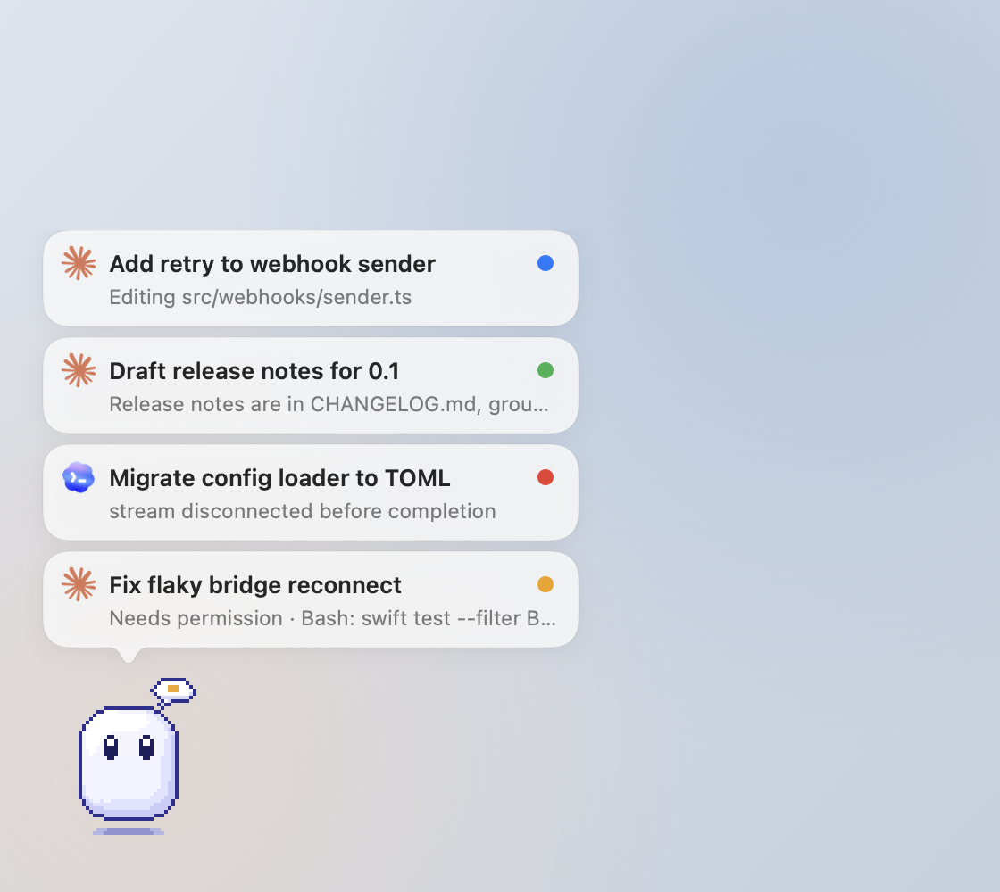
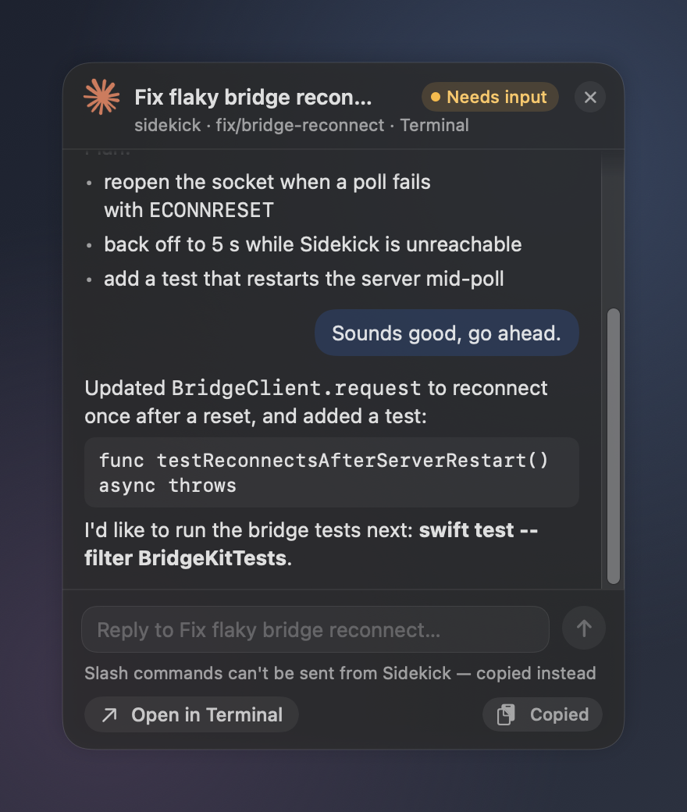
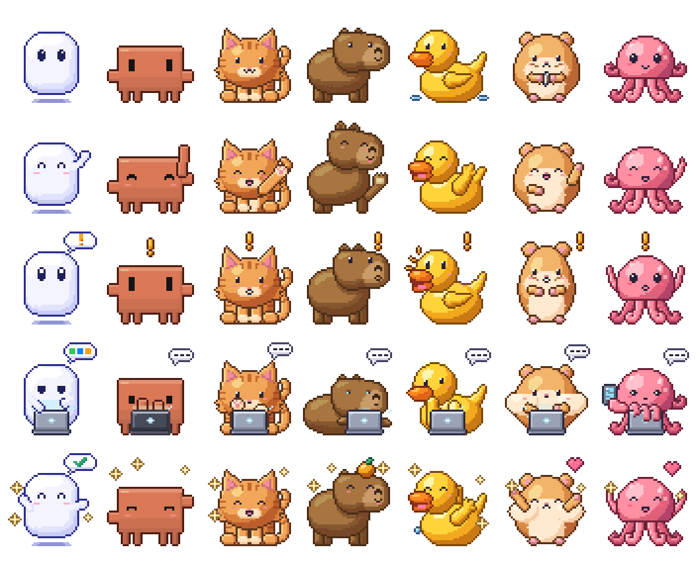

# Sidekick

A desktop pet for macOS that keeps an eye on your coding agents. It watches every **Claude Code** and **Codex** thread on your Mac, wherever it runs: the terminal, the Claude desktop app, the Codex desktop app or VS Code. Each thread shows up as a speech bubble above the pet. Click a bubble to reply, or jump straight to the thread.

<p align="center">
  
</p>

## What it does

- **Bubbles.** One bubble per active thread, sorted by what needs you: **Needs input**, **Failed**, **Ready**, **Running**, **Idle**. Each bubble shows the title, a status chip, the latest line from the agent and the tool's own icon.
- **Pet.** The pet reacts to the most urgent thread. It waves on hover and runs while you drag it. Click the pet to show or hide the bubbles. A click anywhere else on the screen hides them again, and the pet keeps a badge with the number of threads that need you.
- **Mini chat.** Click a bubble for a small chat: the recent messages plus a box to send a command into that same live thread.
- **Open.** The ↗ on a bubble, or **Open in …** in the chat, jumps to the thread in its own app. That's the Claude desktop session, the Codex thread, or the exact terminal tab (Terminal.app, Ghostty or tmux).
- **Pets.** Nine built in: Clawd, Mr. Meeseeks, Ghost, Cat, Robot, Capybara, Rubber Duck, Hamster and Octopus. Pets use the [Codex pet format](#pets), so Codex custom pets work too. Some pets talk ("Ooooh, can do!").

<p align="center">
  
  &nbsp;
  
</p>

## How it talks to Claude Code and Codex

Neither tool has a public "control a running session" API. Sidekick uses what each tool already exposes, and it only reads their files; it never changes them.

| | Claude Code | Codex |
|---|---|---|
| **Find threads** | The live session registry, `~/.claude/sessions/<pid>.json`. It covers terminal, desktop app and VS Code sessions. | The local thread databases in `~/.codex` (`state_5.sqlite`, `thread_history_1.sqlite`), opened read-only. |
| **Status** | The registry's `busy` / `waiting` / `idle` flags, updated about 100 ms after each change. | Turn state from the databases and the rollout files. "Needs input" comes from Codex hooks (optional). |
| **Messages** | The tail of the session transcript (`~/.claude/projects/…/<session>.jsonl`). | The tail of the rollout file. |
| **Send** | A tiny Claude Code plugin, `sidekick-bridge`, submits your text as your own prompt into the live session. If Claude is busy, it waits for the current turn to finish. | `codex queue --thread <id> --message …`. The app or CLI that owns the thread runs it within about 10 s. |
| **Open** | `claude://code/continue?session=…` for desktop sessions; the terminal tab for CLI sessions. | `codex://threads/<id>`; the terminal tab for CLI threads. |

Everything stays on your Mac. Sidekick, the plugin and the hook talk over a Unix socket at `~/Library/Application Support/Sidekick/bridge.sock`, mode 0600. [docs/BRIDGE.md](docs/BRIDGE.md) describes the protocol, and [docs/SPEC.md](docs/SPEC.md) describes the full behaviour.

## Requirements

- macOS 14 or later, Apple silicon. It's developed on macOS 26, where the bubbles use Liquid Glass.
- Xcode or the Swift 6 toolchain to build.
- Claude Code 2.1.287 or later, for plugin "mods". Sending from the pet needs this; seeing threads doesn't.
- Codex CLI 0.159 or later, or the Codex desktop app.

## Install

Download `Sidekick-<version>.dmg` from [Releases](https://github.com/vgnshiyer/sidekick/releases/latest), open it and drag **Sidekick** into **Applications**. The app is signed and notarized by Apple, so it opens without warnings. The pet appears in the bottom-left corner. Use the paw icon in the menu bar to switch pets, change the size, hide the pet or quit.

## Build from source

```sh
git clone https://github.com/vgnshiyer/sidekick.git
cd sidekick
scripts/bundle.sh          # release build -> build/Sidekick.app (ad-hoc signed if you have no Developer ID)
open build/Sidekick.app
```

`scripts/release.sh <version>` builds the notarized DMG for a release. It needs a Developer ID certificate and a `notarytool` keychain profile; the script's header says how to make one.

## Turn on sending and "Needs input"

Two optional, one-time installs. Both scripts can be run again safely and both take `--uninstall`. The app carries them, so you don't need the source:

```sh
/Applications/Sidekick.app/Contents/Resources/Bridge/scripts/install-claude-bridge.sh   # the sidekick-bridge plugin, for your user
/Applications/Sidekick.app/Contents/Resources/Bridge/scripts/install-codex-hooks.sh     # merges Sidekick's hooks into ~/.codex/hooks.json (backs it up first)
```

From a source checkout, run the same scripts from `scripts/`.

- **Claude:** new sessions load the plugin automatically. In sessions that are already open, run `/reload-plugins`. A prompt sent from Sidekick shows up under a dim "Prompt from the sidekick-bridge plugin" line. Slash commands can't be sent by plugins, so Sidekick copies them to the clipboard and opens the session instead.
- **Codex:** trust the new hooks once, in the Codex app (**Settings > Hooks**) or with `/hooks` in the CLI. Sidekick leaves your `config.toml` and `notify` setting alone.

## Command line

```sh
swift run sidekick-cli list            # every active thread with its status
swift run sidekick-cli messages <id>   # recent messages in a thread
swift run sidekick-cli send <id> "run the tests again"   # needs Sidekick running
swift run sidekick-cli open <id>
```

## Pets

A pet is a folder holding a `pet.json` and a `spritesheet.png`, in the same format as Codex custom pets. The spritesheet is 1536×1872: 8 columns × 9 rows of 192×208 cells. Rows: idle, run right, run left, wave, jump, failed, waiting, working, done.

Sidekick loads pets from three places:
- the app bundle;
- `~/Library/Application Support/Sidekick/Pets/`;
- `~/.codex/pets/`, read-only.

To show a quip bubble, add `"quips": {"sent": "…", "working": "…"}` to `pet.json`. Codex ignores the key.

The built-in pixel pets are drawn in code with `tools/petgen` (Python standard library only):

```sh
python3 tools/petgen/petgen.py build cat      # writes the pack plus previews in tools/petgen/out/cat/
```

Mr. Meeseeks is built from a face image by `swift tools/petgen/ballpet.swift`. [tools/petgen/STYLE.md](tools/petgen/STYLE.md) is the style guide.

## Limitations

- Claude Code's session registry and transcripts, and Codex's databases, are internal formats and can change between releases. When they do, Sidekick shows fewer threads; it doesn't break the tools.
- Plugin mods are an early-access Claude Code feature. An organisation policy that blocks plugin network access turns sending off; Sidekick then falls back to copying your text to the clipboard.
- Codex runs queued messages when the thread is idle. If you stopped the thread's last turn, the message waits until you resume it in Codex.
- macOS only.

## Credits and trademarks

Sidekick isn't affiliated with Anthropic, OpenAI or Adult Swim.

- **Mr. Meeseeks** is a character from *Rick and Morty* (Adult Swim). **Clawd** is Anthropic's Claude Code mascot. Both pets are fan art. The MIT license below covers Sidekick's code and the original pets (Ghost, Cat, Robot, Capybara, Rubber Duck, Hamster and Octopus). It doesn't cover those characters.
- The Claude and Codex logos in the bubbles are read at runtime from the apps installed on your Mac; this repository doesn't include them.

## License

[MIT](LICENSE)
